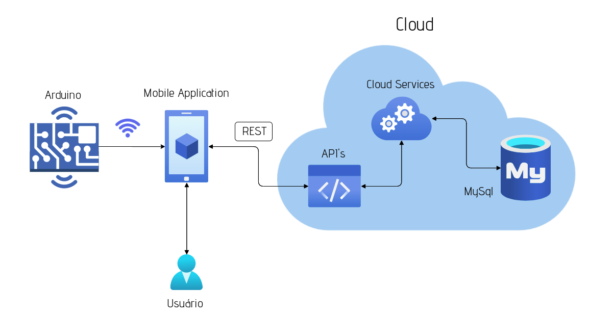

# UpPosture

A fim de atender as necessidades de saúde e bem-estar, o projeto visa corrigir a memória corporal, trabalhando com a questão postural dos usuários, alertando quando estiverem com a postura equivocada e indicando a melhor posição quando sentados.  

O produto consiste em um conjunto de sensores de força resistiva que serão integrados a cadeiras, nas partes do assento e encosto. O sistema de funcionamento será uma aplicação para dispositivos móveis, que controla os dados recebidos dos sensores, e gera um aviso para o usuário quando sua postura estiver incorreta. A aplicação exibirá um relatório estatístico mostrando os gráficos que representarão avaliações da postura do usuário, como o monitoramento de qualidade da postura baseada no tempo de uso da cadeira, o comparativo diacrônico da postura, entre outros. 

Inicialmente, o Arduino lerá os dados dos sensores de força da cadeira e os processará e enviará para o dispositivo mobile. A aplicação presente no dispositivo móvel controla os dados recebidos dos sensores e gera um aviso para o usuário quando sua postura estiver incorreta, além disso é responsável por formatar e exibir os dados recolhidos para o usuário. Um serviço de backend, feito em linguagem Java, será hospedado pela aplicação Web Service, armazenando o projeto e suas API’s RestFull na nuvem. Esta aplicação se conecta com um banco de dados MySql também presente na nuvem. 

O projeto backend contará com alguns serviços de cadastro e consulta, abaixo será listado os mais importantes para o bom funcionamento do projeto que já foram implementados: 

O serviço de listagem e inserção de novos relatórios diários. Todos os dias um relatório referente a razão entre a qualidade da postura do usuario e o tempo de uso da cadeira será gerado e armazenado no banco para consultas futuras, portanto criaremos os serviços de consulta desses relatórios e de criação dos relatórios diários. 

## Edpoints

### Serviços referentes ao resumo diário: 
| Nome    | Path                                 | Verbo  | Ação                                      |
|---------|--------------------------------------|--------|-------------------------------------------|
| Create  | /users/{UserId}/daily-summaries      | POST   | Inserir novo relatório diário.            |
| FindOne | /users/{UserId}/daily-summaries/{id} | GET    | Mostra os dados de apenas um dia.         |
| Delete  | /users/{UserId}/daily-summaries/{id} | DELETE | Apaga um relatório diário.                |
| FIndAll | /users/{UserId}/daily-summaries      | GET    | Lista todos os relatórios.                |
| Update  | /users/{UserId}/daily-summaries/{id} | PUT    | Atualiza os dados de um relatório diário. |

O Daily Summary será o resumo da postura do usuário ao decorrer do dia, e será usado em diversos gráficos e dashboards dentro da aplicação mobile, precisando ser consultado e acrescentado diariamente.

### Serviços referentes a um usuário:

| Nome     | Path        | Verbo  | Ação                              |
|----------|-------------|--------|-----------------------------------|
| Create   | /users      | POST   | Criar um novo usuário.            |
| Update   | /users/{id} | PUT    | Atualiza os dados de um usuário.  |
| Inactive | /users/{id} | DELETE | Inativação lógica de um usuário.  |
| Login    | /users/{id} | GET    | Verifica as informações de login. |

O Usuário será responsável por representar a pessoa que está acessando o aplicativo, ele precisará estar logado para utilizar o produto, controlando todo o funcionamento da aplicação. 

### Serviço referente a postura do usuário: :

| Nome    | Path     | Verbo | Ação                                                                       |
|---------|----------|-------|----------------------------------------------------------------------------|
| FindOne | /posture | GET   | Mostra as informações da postura e caso haja, as dicas relacionadas a ela. |

O serviço será utilizado para buscar as informações de uma postura e possíveis dicas para informar o usuário de como é possível melhorar sua postura. 

### TheBugs
RM 85473 - Danilo Maia Boccomino,
RM 85555 - Felipe da Silva Marcondes,
RM 85542 - Giovanna Caroline Adorno,
RM 83448 - Gustavo Malvone,
RM 85634 - Murilo Augusto Pereira Nascimento

